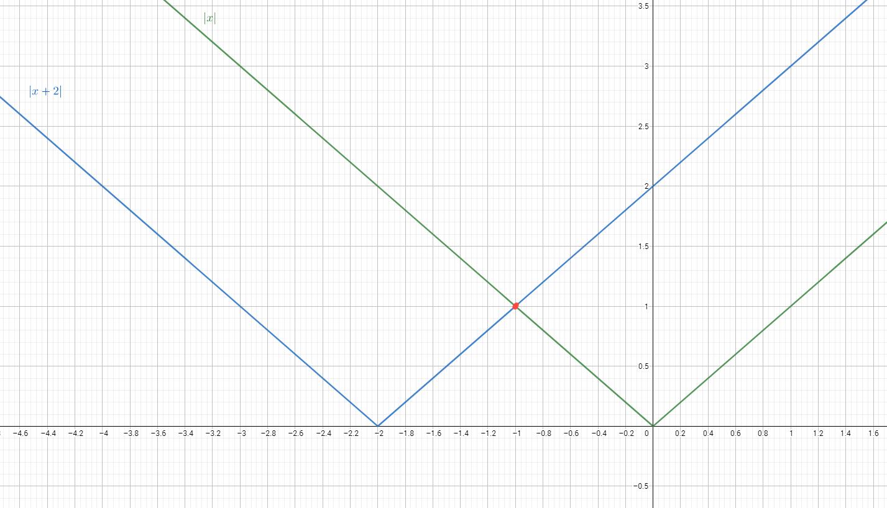
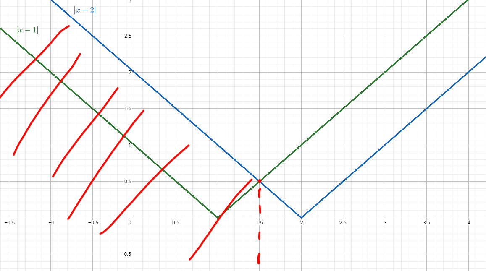

---
Cálculo 2017/18
Folha de Exercícios 1
---

### Exercício 1

(a) $x^2<y^2;$ **Falso**, 

$$
x=-2;\ y=-1;
$$

(b) $x^3<y^3;$  **Verdadeiro**, um vez que a função cúbica é injectiva

(c) $\frac{1}{x} < \frac{1}{y} \ (x,y \neq 0);$ **Falso**, 

$$
x=\frac{1}{2}; \ y=2;
$$

(d) $\frac{1}{x^3} > \frac{1}{y^3};$ **Falso**,

$$
x=-1; \ y=1;
$$

### Exercício 2

(a) $\{x\in I\!R: |x+4|=3\}$ = **$\{-7;-1\}$**

$$
|x+4|=3 \\ 
\Leftrightarrow  x+4 =-3 \ \vee x+4=3 \\  
\Leftrightarrow  x= -7 \ \vee x=-1
$$

(b) $\{ x \in I\!R: \sqrt{(x+1)^2} = 3\}$ = $\{-4;2\}$ 

$$
\Leftrightarrow |x+1|=3 \\ \Leftrightarrow x+1 =-3 \vee x+1 = 3 \\ \Leftrightarrow x= -4 \vee x =2
$$

(c) $\{ \in I\!R: |x|=|x+2|\}$ = $\{-1\}$

### Exercício 3

$$
|x-a| < \varepsilon \\
\Leftrightarrow -\varepsilon < x-a < \varepsilon \\
a-\varepsilon < x < a + \varepsilon \\
\Rightarrow \Delta = 2\varepsilon
$$

(c) $]0,4[$ 
$$
\Delta = 4 \Rightarrow \varepsilon = 2 \\
a =2
$$
(d) $]-3,7[$
$$
\Delta = 10 \Rightarrow \varepsilon = 5 \\
a = -5
$$

### Exercício 4

(a) $\{x \in I\!R:1-x \leqslant 2 \}$ = $[-1,+\infty[$
$$
1-x \leqslant 2 \\
\Rightarrow 1-2 \leqslant x \\
x \geqslant -1 \\
x \in [-1;+\infty[
$$

(b) $\{x \in I\!R:0 \leqslant 1-2x \leqslant \}$ = $[0,\frac{1}{2}[$

$$
0 \leqslant 1-2x \leqslant \\
\Leftrightarrow -1 \leqslant -2x \leqslant 0 \\
\Leftrightarrow -\frac{1}{2} \leqslant -x \leqslant 0 \\
\Leftrightarrow 0 \leqslant x \leqslant \frac{1}{2} \\
$$

(c) $\{x \in I\!R:x^2>5\}$ = $x \in ]-\infty,-\sqrt{5}[ \ \cup\ ]\sqrt{5},+\infty[$

$$
x^2>5 \\ 
\Leftrightarrow x^2-5>0  \\ 
\Leftrightarrow (x-\sqrt{5})(x+\sqrt{5})>0
$$

Tabela de Sinais:
|              |      | $-\sqrt{5}$ |      | $\sqrt{5}$ |      |
| ------------ | ---- | ----------- | ---- | ---------- | ---- |
| $x-\sqrt{5}$ | -    |             | -    | 0          | +    |
| $x-\sqrt{5}$ | -    | 0           | +    |            | +    |
|              | -    | 0           | -    | 0          | +    |

(g) $\{x\in I\!R: |5x+2|\leqslant 1\}$ = $[-\frac{3}{5}; -\frac{1}{5}$
$$
|5x+2| \leqslant 1 \\
\Leftrightarrow -1 \leqslant 5x+2 \leqslant 1 \\
\Leftrightarrow -3 \leqslant 5x \leqslant -1 \\
\Leftrightarrow -\frac{3}{5} \leqslant x \leqslant -\frac{1}{5}
$$
(f) $\{x \in I\!R:|3-x| \geqslant 2 \}$ = $]-\infty,1] \ \cup\ [5,+\infty[$

$$
3-x| \geqslant 2 \\
\Leftrightarrow 3 - x \leqslant -2 \vee 3-x\geqslant 2 \\
\Leftrightarrow x \geqslant 5 \vee x \leqslant 1
$$

(l) $\{x \in I\!R:|x-1|<|x-2| \}$

